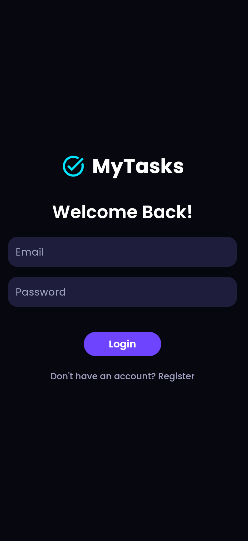
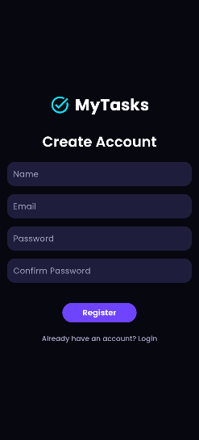
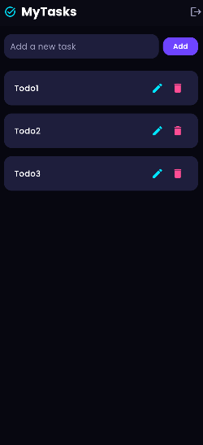

```bash
https://api-mytasks.x10.mx/
```
# 📝 MyTasks

**MyTasks** is a simple and powerful task management application built with Laravel (API), React (Web), and Flutter (Mobile). It helps users create, manage, and track their daily to-do lists with ease.

---

## 🔧 Technologies Used

- **Backend**: Laravel 11 + Sanctum (for API authentication)
- **Mobile App**: Flutter
- **Database**: MySQL

---

## 📱 Features

### ✅ For Users:
- Register & Login
- Create, update, and delete tasks
- Responsive UI (Web) / Clean UI (Mobile)

### 🔒 Authentication:
- Token-based API authentication using Laravel Sanctum

---
## 📱 Screenshots

### Login 


### Register


### Todo


---
## 🚀 Installation Guide

### 1. Clone the Repository

```bash
git clone https://github.com/vortix-dev/mytasks-laravel-flutter.git
cd mytasks
